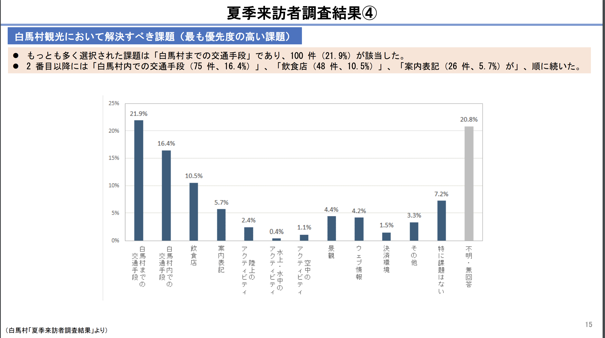

# group1 カフェ案

- ①白馬村を訪れる観光客についての分析
- ②スタバのような持参したマイボトルにドリンクを入れてもらう制度についての分析
- ③カフェへの宣伝方法

## ①白馬村を訪れる観光客についての分析
#### どのような観光客が多いか
- スキーを目的とした外国人観光客数は大きく増加しているものの、日本人観光客数の減少により、延べ観光客数は今後さらに減る可能性がある。
-  回答者の約半数（419名、51.0%）がオーストラリア国籍を有し、もっとも高い割合を示した。
- 男女ともに、最も多かった年代は20代であり、2番目以降には30代、40代、50代がそれぞれ続いた。
- 各年代が占める割合を男女間で比較すると、20代および50代は女性の方が、60代は男性の方が高かったが、全体として年代の分布に性別の差はみられなかった。

#### 観光客の過ごし方
- （冬）週末の1泊2日型が中心の日本人観光客と異なり、スキーシーズンに訪れる外国人観光客は1週間から10日間程度にわたって滞在している。
- （夏）宿泊旅行のうち、もっとも多く選択された泊数は2 泊であり、126 名（37.3%）が該当した。2 番目に多く選択された泊数は1 泊であり、111 名（34.6%）が該当した。

→スキーなどのアウトドアの体験目的が多い中、温泉や景観を楽しむ人も多い。

[夏の白馬村観光スポット紹介](https://www.nsd-hakuba.jp/hakuba-summer/must-spot.html)

#### 観光客の意見

- 白馬はアウトドアの体験施設は多いと思いますが 毎回雨の日に行ける場所が余り無いので陶芸体験の施設などがあると嬉しいと思います。
- 天気が悪いと行けるところは少ないのは残念だが、近くに美術館などもあり楽しめた。今回、白馬の道の駅のチラシ等をみた際に、ご来光のイベントや熱気球のイベント等色々とやっていることを知れたので、次回は天気が安定した時に来たいなと思っている。天気が影響することは仕方がないが、その時に代わりになるような限定イベントやカフェがあると良いです。
- 白馬らしいメニューの飲食店かチェーン店を充実させて欲しいです。

[白馬村における観光の現状と課題](https://www.vill.hakuba.lg.jp/material/files/group/2/03_73905883.pdf)

## ②スタバのような持参したマイボトルにドリンクを入れてもらう制度についての分析
### スタバのマイボトル制度が多くの人に受け入れられている理由
- ドリンクが20～30円程安くなる
- 紙やプラスチックのコップが不要なのでエコ
- 店側の容器のコスト削減
- 洗練されたデザイン、スタバのロゴに魅力

唯一残念なポイント → 価格が高い割に低機能

### 欲しくなるマイボトルとは？
- 自ら洗浄する水筒
- 持ち運びしやすい
- 廃棄プラスチックを集めて作られた水筒

[ネットにあったマイボトル普及させるアイデア](https://ideasforgood.jp/matome-my-bottle/)

### アプリ「mymizu」の利用
実際にアプリを入れて白馬村の給水スポットを調べてみたのですが、7カ所程しかありませんでした。そこで私たちがお願いをして、白馬村の観光スポットやカフェを無料給水スポットとして登録していただくのはいかがでしょうか？ 給水スポットが増えれば、マイボトル普及率も上がると思います。

#### 白馬村のオリジナルグッズ
- [（白馬村観光局）キーホルダー、Tシャツ、手ぬぐい、スクイズボトル、マスク](https://hakubaoriginal.shop/)
- [（スノーピークランドステーション）ステンレス製のコップ、水筒](https://www.snowpeak.co.jp/landstation/hakuba/facility/store/)
- [（ふるさと納税）NORTHFACE　Tシャツ、キャップ](https://search.rakuten.co.jp/search/mall/%E3%81%B5%E3%82%8B%E3%81%95%E3%81%A8%E7%B4%8D%E7%A8%8E+%E7%99%BD%E9%A6%AC%E6%9D%91+%E3%83%8E%E3%83%BC%E3%82%B9%E3%83%95%E3%82%A7%E3%82%A4%E3%82%B9/)
- [（ふるさと納税)　ミルキークイーン10kg、スキー場1日券、登山用ザック、SUY（水）など](https://www.furusato-tax.jp/city/product/20485)

## ③カフェへの宣伝方法
### 
[食べログ 白馬の人気カフェランキングTOP10](https://s.tabelog.com/cafe/nagano/A2005/A200503/rank/)

観光客が多く集まるカフェにマイボトル制度を導入していただくことで、白馬の水の知名度も上がると考えます。この中からまずは5店舗くらいをピックアップして、協力していただくカフェの数を徐々に拡大していくのはどうでしょうか？
お店側にあるメリットを明確にできるだけ多く掲示できれば、マイボトル制度を受け入れていただけると思います。

#### ＜お店側のメリット＞
- 容器のコスト削減
- 「mymizu」に登録すると足を運ぶ人が増える可能性

#### ＜カフェとの連携について＞
- 白馬村観光局に観光振興に協力して頂ける可能性がある
- カフェにとってのマイボトル制度導入の利点は容器コストの削減であり、スタバのようにドリンクの値段を少し割引するのは大きなデメリットである
- 多くのカフェに協力してもらうことで地域活性化に繋がる
- 高校生が村内のカフェだけではなく観光局とも協力するという大きな動きは、話題となって知名度が上がり観光客も増える可能性

### カフェと観光局　案
上記の理由から
白馬村のオリジナルグッズであるスクイズボトルか水筒を購入した人は、登録されているカフェに行けばその容器にドリンクを入れてもらうことが出来る。そしてカフェ1店舗ごとにポイントが貯まり、何ポイントか貯まったら白馬村観光局のオリジナルグッズが割引で買える、もらえるor白馬の水（紙パックに入ったもの）がもらえるという制度を観光局とカフェに導入してもらうのはいかがでしょうか？また、スキー場などのアウトドア体験ができる施設にmymizuの給水スポットとして登録していただくのも良いと思いました。

マイボトル普及と並行して、白馬村の水をアピールしたい。

#### ＜高校生から聞いた白馬の水の魅力＞
- 北アルプスの山の水や川の水を引いている
- 浄水場が3つある
- 塩素消毒をしていない

→水道の蛇口を捻ればミネラルウォーターが飲める

#### ＜『翠－SUY－』について（長野経済研究所のサイトによると）＞
- 白馬村の大出地区では、地表から地下400ｍに蓄積する玉石混じりの砂礫に貯水された高密度できめ細かい天然水と、地殻プレートの動きによって地下数十km～百kmから押し上げられるスラブ起源水との混合水が湧き出ており、この地域ならではの良質な天然水である

↑これに地下水に大量に含まれる鉄分を取り除くことで臭みを消し、天然の植物・鉱物に由来する微量のミネラルを配合することで旨味を増幅させたものがSUY

『翠－SUY－』のメインターゲットを都市部の富裕層に設定し、健康志向や高級志向を追及した。松屋以外の百貨店等に広げるほか、欧米を中心に海外販売にも取り組んでいく予定。

[『翠－SUY－』についての記事](http://www.neri.or.jp/www/contents/1552005308155/index.html)

### アピール内容
上記の内容を踏まえ、以下の内容でポップを作り、オリジナルグッズ販売所に展示する。

高級料理店などで使われるSUYの元となっている白馬の水が水道の蛇口を捻るだけで飲むことができる。村内のカフェはその水を使っており、さまざまな料理やドリンクと共に特別な味わい（他の水道水とは違った口当たりが良いなど）を楽しむことができる。
